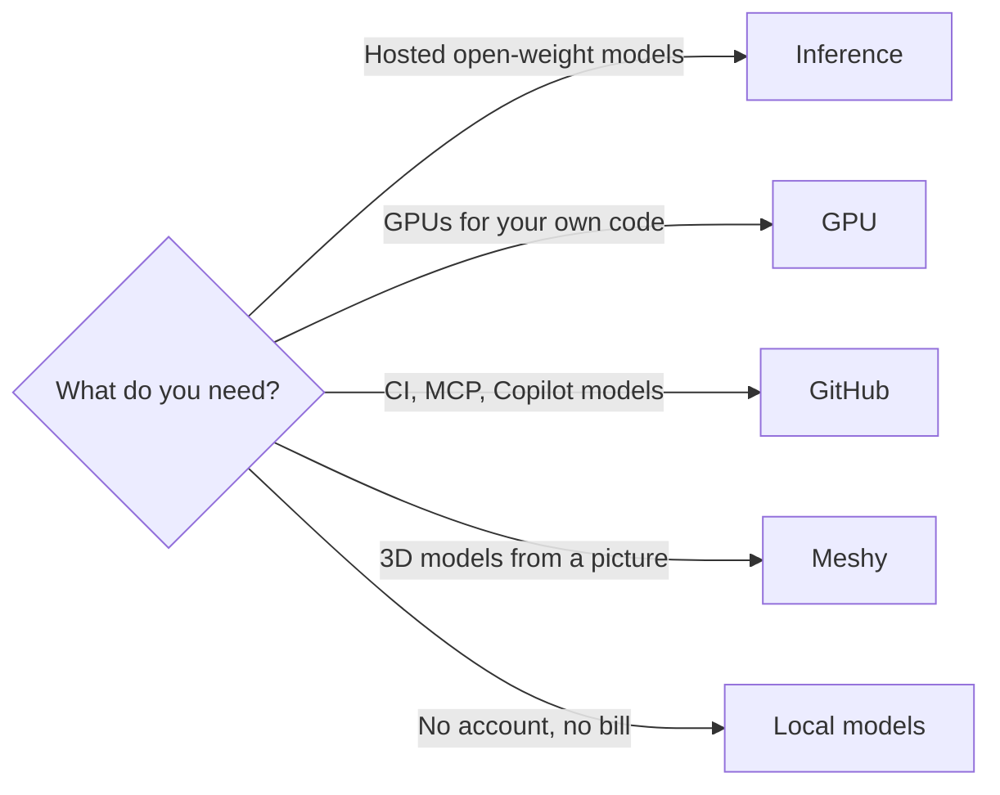

# Provider guides

One page per provider. Each opens with one table: account, free tier, login or key, Claude connector, OpenCode, guard. Four topic pages open with their own table or text: [Local models](local-models.md), [Logins](logins.md), [Training](training.md) and [Claude Desktop MCP](claude-desktop-mcp.md).

```mermaid
flowchart LR
  Q{What do you need?} -->|Hosted open-weight models| I[Inference]
  Q -->|GPUs for your own code| G[GPU]
  Q -->|CI, MCP, Copilot models| T[GitHub]
  Q -->|3D models from a picture| D[Meshy]
  Q -->|No account, no bill| M[Local models]
```

| Guide | Lane | What it covers |
| --- | --- | --- |
| [Hugging Face](hugging-face.md) | Inference, GPU | Hub models, ZeroGPU Spaces, Inference Providers, its MCP server |
| [NVIDIA](nvidia.md) | Inference | NIM trial endpoints, NGC containers, the CUDA docs MCP server |
| [Groq](groq.md) | Inference | Fast hosted open-weight models on a free plan |
| [OpenRouter](openrouter.md) | Inference | One OpenAI-compatible API over many vendors, with `:free` variants |
| [Together AI](together.md) | Inference | Prepaid per-token open-weight models |
| [Cloudflare Workers AI](cloudflare-workers-ai.md) | Inference | A free daily Neurons allocation and hosted MCP servers |
| [Ollama](ollama.md) | Inference | Cloud models on a $0 plan's usage credits, and Claude Code and OpenCode launchers |
| [Claude API](claude-api.md) | Inference | API credits in Max, Ultra and Team plans, and keyless CI through workload identity federation |
| [Modal](modal.md) | GPU | Serverless GPUs for your own code, and Shared Endpoints |
| [RunPod](runpod.md) | GPU | Prepaid GPU pods and Serverless endpoints, the RunPod MCP server |
| [AMD](amd.md) | GPU | ROCm, and one-time AMD Developer Cloud credit |
| [Google Cloud](google-cloud.md) | CPU, GPU | The $300 Free Trial, what it cannot pay for, the upgrade, a budget kill switch, quotas |
| [ComfyUI](comfyui.md) | GPU | Comfy Cloud, comfy-cli, and the [comfyui-base](https://github.com/SoulCraft-Org/comfyui-base) installer |
| [Meshy](meshy.md) | 3D | Picture or prompt to a textured, rigged, animated model on a Pro subscription, through its CLI and skills or its MCP server |
| [Claude Desktop MCP](claude-desktop-mcp.md) | Client | One MCP server for the Code tab and Cowork: a custom connector or a desktop extension |
| [GitHub](github.md) | CI, tools | Actions, `gh` login, the GitHub MCP server, the App manifest flow, Copilot in OpenCode |
| [Local models](local-models.md) | Local | MLX and LM Studio serving a model on your own port |
| [Logins](logins.md) | Accounts | One sign-in order, passkeys and codes in Apple Passwords, the logins catalog and starter |
| [Training](training.md) | GPU | LoRA, then RL such as GRPO, on free and subscription credits: jobs by GPU size, lanes, lanes to avoid |
| [Zed](zed.md) | Client | An editor running open-weight models on your keys, and coding agents over ACP |
| [Goose](goose.md) | Client | An open-source agent, CLI and desktop app, with keys in the system keyring |

Each guide cites every free-tier figure with the vendor's page and the date it was read. [catalog/plans.json](../catalog/plans.json) holds every vendor's plans.

## OpenCode 2

The key store, hidden prompt, `--standalone`, update and `{env:VAR}` rules are in [OpenCode 2 rules](reference/opencode-2.md).

## Rules every guide follows

| Rule | Source |
| --- | --- |
| Free tiers and included credits only | [Git Crafter compute rules](https://github.com/SoulCraft-Org/git-crafter/blob/main/rules/compute.md) |
| A CLI login or OAuth first; an env var name, never a key value | [Git Crafter key rules](https://github.com/SoulCraft-Org/git-crafter/blob/main/rules/keys.md) |
| The Guard column names the vendor's own stop at the free limit, and what removes it | [CONTRIBUTING.md](../CONTRIBUTING.md) |

## Names

The vendor, the plan and the consumer name every plan, key and variable: see [Names](reference/names.md).
